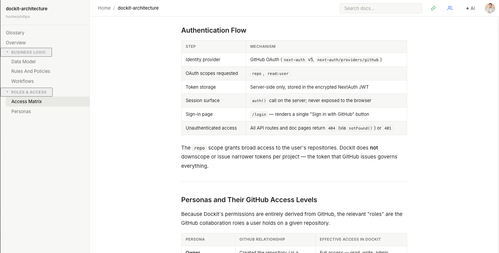

# Dockit

A GitHub-backed documentation platform for cross-functional teams. Dockit is a Next.js UI layer over a GitHub repository — GitHub is the source of truth for all document content. There is no document database; reads and writes go directly to GitHub via the Octokit REST client.



## Features

- **WYSIWYG editing** — BlockNote block editor with image/asset upload
- **GitHub as backend** — every save is a commit; SHA-based concurrency prevents silent overwrites
- **Full-text search** — client-side MiniSearch index built from all docs on load
- **AI assistant** — streaming Q&A and AI-suggested edit mode powered by Claude
- **Auto-document** — link a source code repo, select files to focus on, and let an AI agent generate documentation by reading them
- **Unified diff preview** — review AI-proposed edits before applying

## Stack

- **Next.js 16** (App Router) + TypeScript
- **next-auth v5** — GitHub OAuth
- **@octokit/rest** — all GitHub API calls
- **BlockNote** — WYSIWYG editor
- **react-markdown** + remark-gfm — document viewer
- **MiniSearch** — client-side full-text search
- **@anthropic-ai/sdk** — AI assistant and auto-doc agent
- Vanilla CSS (CSS Modules + design tokens in `globals.css`)

## Getting Started

### 1. Create a GitHub OAuth App

Go to GitHub → Settings → Developer settings → OAuth Apps → New OAuth App.

- Homepage URL: `http://localhost:3000`
- Callback URL: `http://localhost:3000/api/auth/callback/github`

Copy the Client ID and generate a Client Secret.

### 2. Configure environment variables

```bash
cp .env.local.example .env.local
```

Fill in `.env.local`:

```
GITHUB_CLIENT_ID=        # from your GitHub OAuth app
GITHUB_CLIENT_SECRET=    # from your GitHub OAuth app
AUTH_SECRET=             # openssl rand -base64 32
ANTHROPIC_API_KEY=       # from console.anthropic.com
```

### 3. Tag a GitHub repo as a Dockit project

Dockit only shows repos tagged with the `dockit` topic. On any GitHub repo you want to use:

> Settings → Topics → add `dockit`

### 4. Run

```bash
npm install
npm run dev
```

Open [http://localhost:3000](http://localhost:3000). Sign in with GitHub and select a repo to get started. If the repo has no docs yet, use the "Initialize docs" button to scaffold the default structure.

## Project structure

```
src/
  app/               # Next.js App Router — pages, layouts, API routes
  components/        # UI components (layout/, docs/, ai/)
  context/           # React context (ProjectContext, AIPanelContext)
  lib/               # Server-side utilities (GitHub client, auth, AI agent, search)
```

See `CLAUDE.md` for the full file-level breakdown and architectural details.

## Dev commands

```bash
npm run dev      # start dev server (localhost:3000)
npm run build    # production build + type check
npm run start    # start production server
```
